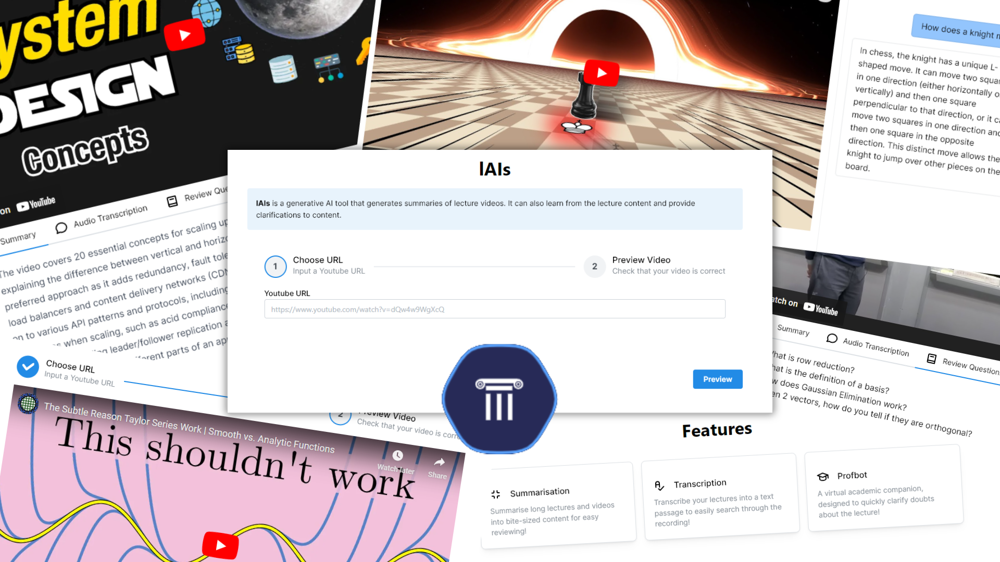
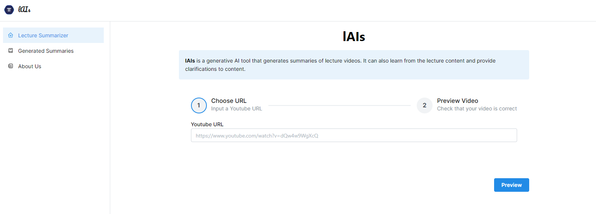
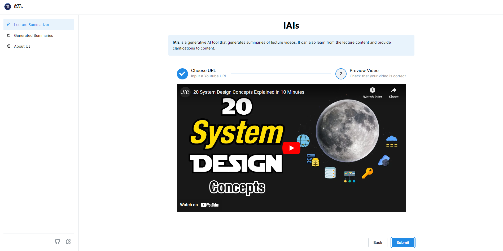
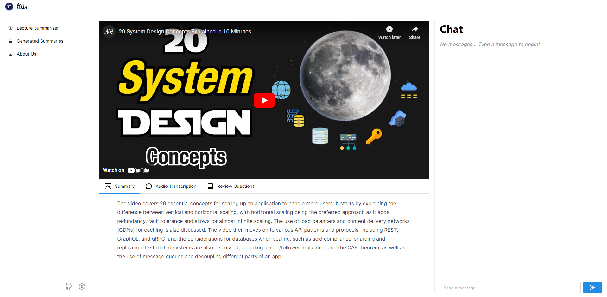

# lAIs: Your AI Companion for Learning!



Done within 24 hours for the NTU Techfest Hackathon

- [Frontend Github Repo](https://github.com/tohhongxiang123/techfest-2024) 
- [Backend Github Repo](https://github.com/prolude1/lAIs_backend) 
- [Youtube Link](https://youtu.be/PLTUUgU7xWY)
- [Devpost Link](https://devpost.com/software/placeholder-7bhy40?ref_content=user-portfolio&ref_feature=in_progress)

## Setup

```
git clone https://github.com/tohhongxiang123/techfest-2024.git
cd techfest-2024

yarn
yarn dev
```

Go to `localhost:3000` to begin development

## Inspiration

Lectures are long, and students often are unable to find the motivation to consume all the knowledge presented to them in one go, especially when the lectures are recorded and therefore easier to put away for later. As students ourselves, we envisioned a tool that could make taking the first steps in learning from recorded lectures much easier. lAIs was developed exactly for this, leveraging on AI to guide students towards quicker understanding of lecture materials by both improving intrinsic motivation, and providing real-time assistance in learning.

## What it does & How does it work?

lAIs is a web-based tool that takes a URL of an uploaded video lecture (on YouTube), and generates a variety of outputs to supplement learning.

1. Take a Youtube URL and paste it in!
    
2. Confirm that the Youtube URL is correct.
   
3. View your generated content!
    

## Features

### (1) Transcription of recorded lecture
An application of OpenAI Whisper to generate a transcript based on the voice recording in the lecture video.

### (2) Summary generation of entire transcription
The generated transcript from (1) is then summarised with Meta’s LLaMa (Large Language Model Meta AI).
Key learning points are identified by the LLM based on the transcript, and are then consolidated into the summary of lecture content.

### (3) Generation of questions to reinforce learning
Based on all content available from (1) and (2), sample questions to test learners’ understanding are generated with the same LLM.

### (4) Profbot
Profbot, the AI assistant that has learnt the lecture content from your recorded lecture(s), and is more than willing to help clarify any doubts students may have while studying their actual resources.

Similar to (3), all available content is parsed through the same LLM to form a foundational knowledge base that will be tapped on to clarify doubts from the provided content. Questions are also processed with the LLM to generate responses based on knowledge gained from previous material.

## Why does it work?

Motivation to initiate and/or commit to a task is often hindered by intrinsic barriers such as inertia and value expectancy. By simply reframing the goal of “sit through a 2-hour lecture recording” to “spend 5 minutes reading a summary before reading further”, lAIs significantly increases the expected value of the task by significantly reducing the time required to engage with lecture content. By encouraging students to take the first step in engaging with lecture content, students will find themselves with psychological momentum in the learning process, making the consumption of additional content less draining. 

The use of an AI chatbot to clarify doubts is also essential to maintaining a high level of motivation - having doubts unanswered in real time often disrupts any momentum gained from earlier engagement, especially when understanding of topic 1 is a prerequisite to learning topic 2. Students no longer need to rely solely on emailing their tutors and waiting for a reply the next business day, and then needing to overcome any inertia to begin learning again.

## Impact and Unintended Consequences

We envision lAIs to primarily aid students - anyone who is trying to learn new content. By making engagement with content easier, productivity of learners should be improved, along with a better quality of life as a result of time savings in the learning process. 

Still, we can expect learners to treat this tool as a shortcut to skip the process of learning from long-form content. This ultimately is counter-productive, as all the necessary (and examinable) details delivered in a lecture must be obtained from proper study of materials. Students should be able to quickly learn that this form of usage of lAIs id detrimental to their learning, and should use it more as a complement to their learning. 

Also, an over-reliance on the chatbot to clarify doubts could also limit the depth of understanding of the material, since the bot is only as intelligent as the source material. Any further insights that could be valuable but not discussed explicitly in the source material are naturally not offered by the bot, and therefore engaging with tutors directly is still a necessary part of this learning process. We still strongly believe that these AI tools are not meant to completely replace tutors, but to make learning more accessible and engaging.

An interesting potential group of users can be the tutors or professors themselves - instead of using lAIs as a learning tool as intended, it could be used as a benchmarking tool to evaluate the delivery of recorded lecture content. Since the AI generates a summary based on observed key pointers, tutors can then check to ensure that their delivery has emphasised all the crucial learning points sufficiently. Else, they could follow-up with learners to further emphasise the key learning points which were not delivered adequately.

Furthermore, the constant availability of a chatbot to clarify doubts on lecture content could also prompt tutors to recommend lAIs to their students to reduce the occurrences of emails asking to clarify doubts. This frees up more of their time, allowing them to engage more in extra-curricular activities such as conducting research. Of course, over-reliance on the bots can lead to shirking responsibility in terms of clarifying the doubts of learners, so it is up to the innate responsibility of tutors to manage the reliance on tools such as lAIs.

## Current Limitations

Due to lAIs being a prototype, we observe the following limitations:

### Slow - running the LLM locally
The prototype is limited by hardware due to LLM processes happening locally. We note that significant generation times can arise when handling very long videos, in addition to memory issues when generating a large transcript to be parsed through the LLM.

### Limited to YouTube URLs
Due to timeline limitations, input material has been limited to only YouTube links. 
The complexity involved in accepting other forms of video content, such as directly uploading .mp4 files from the user’s computer, made implementation of this feature less of a priority. 

### Transcription quality (breaks, accuracy) varies depending on lecturer
We observe varying degrees of success in Whisper’s ability to transcribe the video lecture content accurately due to variations in delivery such as speed and accents. 
Since the full video transcription is the input for all other features of lAIs, the accuracy of this transcription is critical to the good performance of this tool. Issues with the source transcription will more than likely snowball and surface as issues with final outputs such as the summary, and responses given by the Profbot.

### Unable to keep track of previously generated content (user)
Doing this requires implementation of a database, which was not a priority due to time concerns. This could be a useful feature, especially for learners who would like to review content in the future and not need to wait for the generation process every time the same video is uploaded.

## Accomplishments that we're proud of

- An well-polished MVP, which is responsive as well for both mobile and desktop users
- First time successfully implementing Generative AI into a project

## Challenges we ran into

There were many challenges that we ran into, but the biggest ones were
- Getting LLaMa to produce consistent results was difficult. LLaMa was initially inconsistent in producing summaries and test questions, however after prompt engineering, it provided us with more consistent results.
- NextJS 13 was not easy to use. Previously, we only used NextJS 12 for projects, and since NextJS 13 was out for awhile already, we decided to use it for this project. However, it proved to be more challenging than initially thought because of the amount of changes moving from NextJS 12 to NextJS 13, which caused many bugs.
- Difficulties in combining the frontend and backend. Both the frontend and the backend were on 2 separate machines, and it was challenging to setup the communication between them.

## What we learned

- The effectiveness of implementing generative AIs into a project depends heavily on the prompts provided

## What's next for lAIs
- User logins to allow users to access their previously generated summaries and test questions
- Video-specific annotations for each user
- Improved loading times
- More robust chat features
- Security features such as encryption
- Real-time transcribing of lectures you are in
- File uploads instead of just youtube videos

# Resources

https://www.youtube.com/watch?v=PmPkAAu_QF4